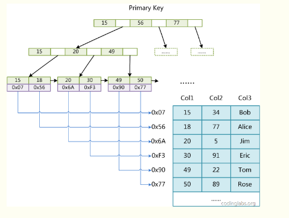

## 1、mysql表类型（引擎）有哪些？  
答：
一：MyISAM：  
在创建MyISAM的时候会出来三个默认的文件  
1.tb_demo.frm，存储表定义；
2.tb_demo.MYD，存储数据；
3.tb_demo.MYI，存储索引。
因为MyISAM表有无法处理事务，所以它只适合在一下几种情况下使用
1.选择密集型的表。MyISAM存储引擎在筛选大量数据时非常迅速，这是它最突出的优点。
2.插入密集型的表。MyISAM的并发插入特性允许同时选择和插入数据。例如：MyISAM存储引擎很适合管理邮件或Web服务器日志数据。  

二：InnoDB：  
在mysql5.6版本以上被作为默认引擎，并且加入了行及锁定与外键约束。  
所以以下是使用InnoDB最好的选择：
1. 更新密集的表。InnoDB存储引擎特别适合处理多重并发的更新请求。
2.事务。InnoDB存储引擎是支持事务的标准MySQL存储引擎。
3.自动灾难恢复。与其它存储引擎不同，InnoDB表能够自动从灾难中恢复。
4.外键约束。MySQL支持外键的存储引擎只有InnoDB。
5.支持自动增加列AUTO_INCREMENT属性。  

三：MEMORY：  
使用MEMORY引擎主要是因为速度，好处就在MEMORY采用的逻辑存储是系统内存,极大的提高了储存数据表的性能；  
坏处就是当mysqld守护进程崩溃时，所有的Memory数据都会丢失。
要求存储在Memory数据表里的数据使用的是长度不变的格式，这意味着不能使用BLOB和TEXT这样的长度可变的数据类型
所以一般在以下几种情况下使用Memory存储引擎：
1.目标数据较小，而且被非常频繁地访问。在内存中存放数据，所以会造成内存的使用，可以通过参数max_heap_table_size控制Memory表的大小，设置此参数，就可以限制Memory表的最大大小。
2.如果数据是临时的，而且必须立即使用，那么就可以存放在内存表中。
3.存储在Memory表中的数据如果突然丢失，不会对应用服务产生实质的负面影响。
Memory同时支持散列索引和B树索引。B树索引的优于散列索引的是，可以使用部分查询和通配查询，也可以使用<、>和>=等操作符方便数据挖掘。散列索引进行“相等比较”非常快，但是对“范围比较”的速度就慢多了，因此散列索引值适合使用在=和<>的操作符中，不适合在<或>操作符中，也同样不适合用在order by子句中  

四：MERGE：  
MERGE存储引擎是一组MyISAM表的组合，这些MyISAM表结构必须完全相同，所以就相当于一个集合器。比起其他储存引擎MERGE不是很优秀，但是在某些情况下MERGE还是非常的有用。对于服务器日志这种信息，一般常用的存储策略是将数据分成很多表，每个名称与特定的时间端相关。  

五：ARCHIVE：  
Archive是归档的意思，在归档之后很多的高级功能就不再支持了，仅仅支持最基本的插入和查询两种功能。在MySQL 5.5版以前，Archive是不支持索引，但是在MySQL 5.5以后的版本就开始支持索引了。Archive拥有很好的压缩机制，它使用zlib压缩库，在记录被请求时会实时压缩，所以它经常被用来当做仓库使用。  

## 2、mysql有哪几种锁？
答：
（1）表级锁：开销小，加锁快；不会出现死锁；锁定粒度大，发生锁冲突的概率最 高，并发度最低。  
（2）行级锁：开销大，加锁慢；会出现死锁；锁定粒度最小，发生锁冲突的概率最 低，并发度也最高。  
（3）页面锁：开销和加锁时间界于表锁和行锁之间；会出现死锁；锁定粒度界于表 锁和行锁之间，并发度一般。  

## 3、MySQL 数据库中 MyISAM 和 InnoDB 的区别？
答：
MyISAM：  
（1）不支持事务，但是每次查询都是原子的；  
（2）支持表级锁，即每次操作是对整个表加锁；  
（3）存储表的总行数；  
（4）一个 MYISAM 表有三个文件：索引文件、表结构文件、数据文件；  
（5）采用菲聚集索引，索引文件的数据域存储指向数据文件的指针。辅索引与主索引基本一致，但是辅索引不用保证唯一性。  
InnoDb：  
（1）支持 ACID 的事务，支持事务的四种隔离级别；  
（2）支持行级锁及外键约束：因此可以支持写并发；  
（3）不存储总行数：  
（4）一个 InnoDb 引擎存储在一个文件空间（共享表空间，表大小不受操作系统控制，一个表可能分布在多个文件里），
也有可能为多个（设置为独立表空，表大小受操作系统文件大小限制，一般为 2G），受操作系统文件大小的限制；  
（5）主键索引采用聚集索引（索引的数据域存储数据文件本身），辅索引的数据域存储主键的值；因此从辅索引查找数据，需要先通
过辅索引找到主键值，再访问辅索引；最好使用自增主键，防止插入数据时，为维持 B+树结构，文件的大调整。  

## 4、MySQL 中 InnoDB 支持的四种事务隔离级别名称，以及逐级之间的区别？ SQL 标准定义的四个隔离级别为？
答：
Read Uncommitted（读取未提交内容）：     
在该隔离级别，所有事 务都可以看到其他未提交事务的执行结果。本隔离级别很少用于实际应 用，因为它的性能也不比其他级别好多少。读取未提交的数据，也被称之为脏读（Dirty Read）。  
Read Committed（读取提交内容） ：  
这是大多数数据库系统的默 认隔离级别（但不是 MySQL 默认的）。它满足了隔离的简单定义：一 个事务只能看见已经提交事务所做的改变。这种隔离级别也支持所谓的 不可重复读（Nonrepeatable Read），因为同一事务的其他实例在该 实例处理其间可能会有新的 commit，所以同一 select 可能返回不同结果。  
Repeatable Read（可重读） ：  
这是 MySQL 的默认事务隔离级 别，它确保同一事务的多个实例在并发读取数据时，会看到同样的数据 行。不过理论上，这会导致另一个棘手的问题：幻读（Phantom Read）。简单的说，幻读指当用户读取某一范围的数据行时，另一个事 务又在该范围内插入了新行，当用户再读取该范围的数据行时，会发现 有新的“幻影” 行。InnoDB 和 Falcon 存储引擎通过多版本并发控制 （MVCC，Multiversion Concurrency Control 间隙锁）机制解决了 该问题。注：其实多版本只是解决不可重复读问题，而加上间隙锁（也 就是它这里所谓的并发控制）才解决了幻读问题。  
Serializable（可串行化）：  
这是最高的隔离级别，它通过强制事务 排序，使之不可能相互冲突，从而解决幻读问题。简言之，它是在每个 读的数据行上加上共享锁。在这个级别，可能导致大量的超时现象和锁竞争。  

InnoDB默认使用的是可重复读隔离级别。

## 5、CHAR 和 VARCHAR 的区别？
答：
char和varchar类型声明长度表示用户想保存的最大字符数，其中char(M)定义的列的长度为固定的，M的取值可以0-255之间，当保存char值时，
在它们的右边填充空格以达到指定的长度。当检索到char值时，尾部的空格被删除掉。在存储或检索过程中不进行大小写转换。  
char存储定长数据很方便，char字段上的索引效率很高。  

varchar(M)定义的列的长度是可变长度字符串，在MySQL5.0以上的版本中，varchar的数据类型长度支持到了65535，
因为起始位和结束位占去了3个字节，所以其整体最大长度为65532字节（varchar的最大有效长度由最大行大小和使用的字符集确定）。  

适用情况：
1、对于MyISAM表，尽量使用Char，对于那些经常需要修改而容易形成碎片的myisam和isam数据表就更是如此，它的缺点就是占用磁盘空间；  
2、对于InnoDB表，因为它的数据行内部存储格式对固定长度的数据行和可变长度的数据行不加区分（所有数据行共用一个表头部分，这个标头
部分存放着指向各有关数据列的指针），所以使用char类型不见得会比使用varchar类型好。事实上，因为char类型通常要比varchar类型占用更多的空间，所以从减少空间占用量和减少磁盘i/o的角度，使用varchar类型反而更有利；  
3、存储很短的信息，比如门牌号码101，201……这样很短的信息应该用char，因为varchar还要占个byte用于存储信息长度，本来打算节约存储的现在得不偿失。  
4、固定长度的。比如使用uuid作为主键，那用char应该更合适。因为他固定长度，varchar动态根据长度的特性就消失了，而且还要占个长度信息。  
5、十分频繁改变的column。因为varchar每次存储都要有额外的计算，得到长度等工作，如果一个非常频繁改变的，那就要有很多的精力用于计算，而这些对于char来说是不需要的。  

## 6、如果一个表有一列定义为 TIMESTAMP，将发生什么？
答：
每当行被更改时，时间戳字段将获取当前时间戳。

## 7、列设置为 AUTO INCREMENT 时，如果在表中达到最大值，会发生什么情况？
答：
它会停止递增，任何进一步的插入都将产生错误，因为密钥已被使用。

## 8、LIKE 声明中的％和_是什么意思？
答：％对应于 0 个或更多字符，_只是 LIKE 语句中的一个字符。

## 9、BLOB 和 TEXT 有什么区别？
答：
BLOB 是一个二进制对象，可以容纳可变数量的数据。TEXT 是一个不区分大小写的 BLOB。  

BLOB 和 TEXT 类型之间的唯一区别在于对 BLOB 值进行排序和比较时区分大小写，对 TEXT 值不区分大小写。  

## 10、MyISAM 表格将在哪里存储，怎么存储？
答：
每个 MyISAM 表格以三种格式存储在磁盘上：
（1）·“.frm”文件存储表定义  
（2）·数据文件具有“.MYD”（MYData）扩展名  
（3）索引文件具有“.MYI”（MYIndex）扩展名  

## 11、可以使用多少列创建索引？
答：
任何标准表最多可以创建 16 个索引列。

## 12、MySQL支持事务吗？
答：
在缺省模式下，MySQL 是 autocommit 模式的，所有的数据库更新操作都会即时提交，所以在缺省情况下，MySQL 是不支持事务的。  
但是如果你的 MySQL 表类型是使用 InnoDB Tables 或 BDB tables 的话，你的MySQL 就可以使用事务处理,使用 SETAUTOCOMMIT=0 就可以使 MySQL 允许在非 autocommit 模式，在非autocommit 模式下，你必须使用 COMMIT 来提交你的更改，或者用 ROLLBACK来回滚你的更改。

## 13、MySQL 里记录货币用什么字段类型好？
答：
货币在数据库中MySQL常用Decimal和Numric类型表示，这两种类型被MySQL实现为同样的类型。  
他们被用于保存值，该值的准确精度是极其重要的值，例如与金钱有关的数据。
当声明一个类是这些类型之一时，精度和规模的能被(并且通常是)指定；例如：
salary DECIMAL(9,2)
在这个例子中，9(precision)代表将被用于存储值的总的小数位数，而2(scale)代表将被用于存储小数点后的位数。
因此，在这种情况下，能被存储在salary列中的值的范围是从-9999999.99到9999999.99。  

DECIMAL和NUMERIC值作为字符串存储，而不是作为二进制浮点数，以便保存那些值的小数精度。  
一个字符用于值的每一位、小数点(如果scale>0)和“-”符号(对于负值)。如果scale是0，DECIMAL和NUMERIC值不包含小数点或小数部分。
不使用float或者double的原因：因为float和double是以二进制存储的，所以有一定的误差。

## 14、MySQL 有关权限的表都有哪几个？
答：
MySQL 服务器通过权限表来控制用户对数据库的访问，权限表存放在 MySQL 数据库里，由 MySQL_install_db 脚本初始化。这些权限表分别 user，db，table_priv，columns_priv 和 host。

## 15、锁的优化策略
答：
（1）读写分离  
（2）分段加锁  
（3）减少锁持有的时间  
（4）多个线程尽量以相同的顺序去获取资源  

不能将锁的粒度过于细化，不然可能会出现线程的加锁和释放次数过多，反而效率不如一次加一把大锁。

## 16、数据库的事务是什么？
答：
事务（transaction）是作为一个单元的一组有序的数据库操作。如果组中的所有操作都成功，则认为事务成功，即使只有一个操作失败，事务也不成功。如果所有操作完成，事务则提交，其修改将作用于所有其他数据库进程。如果一个操作失败，则事务将回滚，该事务所有操作的影响都将取消。  
事务特性：  
（1）原子性：即不可分割性，事务要么全部被执行，要么就全部不被执行。  
（2）一致性或可串性。事务的执行使得数据库从一种正确状态转换成另一种正确状态。  
（3）隔离性。在事务正确提交之前，不允许把该事务对数据的任何改变提供给任何其他事务。  
（4）持久性。事务正确提交后，其结果将永久保存在数据库中，即使在事务提交后有了其他故障，事务的处理结果也会得到保存。  

或者这样理解：
事务就是被绑定在一起作为一个逻辑工作单元的 SQL 语句分组，如果任何一个语句操作失败那么整个操作就被失败，以后操作就会回滚到操作前状态，或者是上有个节点。为了确保要么执行，要么不执行，就可以使用事务。要将有组语句作为事务考虑，就需要通过 ACID 测试，即原子性，一致性，隔离性和持久性。  

## 17、字段类型选择优先级？
答：
字段类型优先级: 整形>date,time>enum,char>varchar>blob,text   
优先考虑数字类型，其次是日期或者二进制类型，最后是字符串类型，同级别得数据类型，应该优先选择占用空间小的数据类型

## 18、解释 MySQL 外连接、内连接与自连接的区别？
答：
先说什么是交叉连接: 交叉连接又叫笛卡尔积，它是指不使用任何条件，直接将一个表的所有记录和另一个表中的所有记录一一匹配。  
内连接：  
则是只有条件的交叉连接，根据某个条件筛选出符合条件的记录，不符合条件的记录不会出现在结果集中，即内连接只连接匹配的行。  
外连接：  
其结果集中不仅包含符合连接条件的行，而且还会包括左表、右表或两个表中的所有数据行，这三种情况依次称之为左外连接，右外连接，和全外连接。  
左外连接：  
也称左连接，左表为主表，左表中的所有记录都会出现在结果集中，对于那些在右表中并没有匹配的记录，仍然要显示，
右边对应的那些字段值以NULL 来填充。右外连接，也称右连接，右表为主表，右表中的所有记录都会出现在结果集中。
左连接和右连接可以互换，MySQL 目前还不支持全外连接。

## 19、Myql 中的事务回滚机制概述？
答：
事务是用户定义的一个数据库操作序列，这些操作要么全做要么全不做，是一个不可分割的工作单位，事务回滚是指将该事务已经完成的对数据库的更新操作撤销。

## 20、什么是锁？
答：
数据库是一个多用户使用的共享资源。当多个用户并发地存取数据时，在数据库中就会产生多个事务同时存取同一数据的情况。若对并发操作不加控制就可能会
读取和存储不正确的数据，破坏数据库的一致性。  
加锁是实现数据库并发控制的一个非常重要的技术。当事务在对某个数据对象进行操作前，先向系统发出请求，对其加锁。加锁后事务就对该数据对象有了
一定的控制，在该事务释放锁之前，其他的事务不能对此数据对象进行更新操作。

## 21、什么是存储过程？用什么来调用？
答：
存储过程是一个预编译的 SQL 语句，优点是允许模块化的设计，就是说只需创建一次，以后在该程序中就可以调用多次。
如果某次操作需要执行多次 SQL，使用存储过程比单纯 SQL 语句执行要快。可以用一个命令对象来调用存储过程。

## 22、如何通俗地理解三个范式？
答：
第一范式：1NF 是对属性的原子性约束，要求属性具有原子性，不可再分解；  
第二范式：2NF 是对记录的惟一性约束，要求记录有惟一标识，即实体的惟一性；  
第三范式：3NF 是对字段冗余性的约束，即任何字段不能由其他字段派生出来，它要求字段没有冗余。  
范式化设计优缺点:  

优点:可以尽量得减少数据冗余，使得更新快，体积小  
缺点:对于查询需要多个表进行关联，减少写得效率增加读得效率，更难进行索引优化  
反范式化:  

优点:可以减少表得关联，可以更好得进行索引优化  
缺点:数据冗余以及数据异常，数据得修改需要更多的成本  

## 23、NULL 是什么意思？
答：
NULL 这个值表示 UNKNOWN(未知):它不表示“”(空字符串)。对 NULL 这个值的任何比较都会生产一个 NULL 值。您不能把任何值与一个 NULL 值进行比较，并在逻辑上希望获得一个答案。  
使用 IS NULL 来进行 NULL 判断

## 24、主键、外键和索引的区别？
答：
定义：  

主键——唯一标识一条记录，不能有重复的，不允许为空  
外键——表的外键是另一表的主键, 外键可以有重复的, 可以是空值  
索引——该字段没有重复值，但可以有一个空值  
作用：
主键——用来保证数据完整性  
外键——用来和其他表建立联系用的  
索引——是提高查询排序的速度  
个数：  
主键—— 主键只能有一个  
外键—— 一个表可以有多个外键  
索引—— 一个表可以有多个唯一索引  

## 25、你可以用什么来确保表格里的字段只接受特定范围里的值?
答：
Check 限制，它在数据库表格里被定义，用来限制输入该列的值。  
触发器也可以被用来限制数据库表格里的字段能够接受的值，但是这种办法要求触发器在表格里被定义，这可能会在某些情况下影响到性能。

## 26、SQL 语句优化有哪些方法？
答：
（1）Where 子句中：where 表之间的连接必须写在其他 Where 条件之前，那些可以过滤掉最大数量记录的条件必须写在 Where 子句的末尾.HAVING 最后。  
（2）用 EXISTS 替代 IN、用 NOT EXISTS 替代 NOT IN。  
（3） 避免在索引列上使用计算   
（4）避免在索引列上使用 IS NULL 和 IS NOT NULL  
（5）对查询进行优化，应尽量避免全表扫描，首先应考虑在 where 及 order by 涉及的列上建立索引。  
（6）应尽量避免在 where 子句中对字段进行 null 值判断，否则将导致引擎放弃使用索引而进行全表扫描  
（7）应尽量避免在 where 子句中对字段进行表达式操作，这将导致引擎放弃使用索引而进行全表扫描  

# 索引相关问题

## 1、索引的目的是什么？
答：
快速访问数据表中的特定信息，提高检索速度。  
创建唯一性索引，保证数据库表中每一行数据的唯一性。  
加速表和表之间的连接。  
使用分组和排序子句进行数据检索时，可以显著减少查询中分组和排序的时间。  

## 2、索引对数据库系统的负面影响是什么？
答：
创建索引和维护索引需要耗费时间，这个时间随着数据量的增加而增加；索引需要占用物理空间，不光是表需要占用数据空间，每个索引也需要占用物理空间；当对表进行增、删、改、的时候索引也要动态维护，这样就降低了数据的维护速度。

## 3、为数据表建立索引的原则有哪些？
答：
在最频繁使用的、用以缩小查询范围的字段上建立索引。  

在频繁使用的、需要排序的字段上建立索引

## 4、什么情况下不宜建立索引？
答：
对于查询中很少涉及的列或者重复值比较多的列，不宜建立索引。  
对于一些特殊的数据类型，不宜建立索引，比如文本字段（text）等。

## 5、mysql索引类型有哪些？
答：唯一索引,主键(聚集)索引,非聚集索引,全文索引.

## 6、聚集索引与非聚集索引的区别？
答：
聚集(clustered)索引,也叫做聚簇索引.  
定义:数据行的物理顺序与列值(一般是主键的那一列)的逻辑顺序相同,一个表中只能拥有一个聚集索引.  
注意:聚集索引做查询可以直接获取对应的全部列的数据.所以聚集查询较快.  

非聚集索引：  
定义:该索引中索引的逻辑顺序与磁盘上行的物理存储顺序不同,一个表中可以拥有多个非聚集索引.
除了聚集索引以外的索引都是非聚集索引,分成普通索引,唯一索引和全文索引.  
注意:非聚集索引查询在索引没覆盖到对应列的时候需要进行二次查询,索引非聚集查询较慢.  
聚集索引以及非聚集索引用的是B+树索引。

## 7、如何解决非聚集索引的二次查询问题？
答：
将单列索引升级为联合索引可以避免回表；  
建立两列以上的索引,即可查询复合索引里的列的数据而不需要进行回表二次查询,如index(col1,col2),执行下面的语句
select col1,col2 from 表名 where col1=‘xxx’;  
要注意使用复合索引需要满足最左侧索引的原则,也就是查询的时候如果where条件里面没有最左边的一到多列,索引就不会起作用.

## 8、描述下MyISAM引擎的索引实现原理。
答：
主键索引：MyISAM引擎使用B+树作为索引结果，叶节点的data域存放的是数据记录的地址。下图为MyISAM表的主索引，Col1为主键。  

辅助索引：在MyISAM中，主索引和辅助索引在结构上没有任何区别，只是主索引要求key是唯一的，而辅助索引的key可以重复。下图在Col2上建立一个辅助索引。  

同样也是一颗B+Tree，data域保存数据记录的地址。因此，MyISAM中索引检索的算法为首先按照B+Tree搜索算法搜索索引，如果指定的Key存在，则取出其data域的值，然后以data域的值为地址，读取相应数据记录。  
MyISAM的索引方式也叫做“非聚集”的，之所以这么称呼是为了与InnoDB的聚集索引区分。

## 9、描述下InnoDB引擎的索引实现原理。
答：
主键索引：同样是B+树，实现方式却完全不同。InnoDB表数据文件本身就是一个索引结构，树的叶节点data域保存了完整的数据记录，这种索引叫做聚集索引。  

 因为InnoDB的数据文件本身要按主键聚集，所以InnoDB要求表必须有主键(MyISAM可以没有)，如果没有显式指定，则mysql会自动选择一个可以唯一标识数据记录的列作为主键。如果不存在这种列，则mysql自动为InnoDB表生成一个隐含字段作为主键，这个字段长度为6个字节，类型为长整型。  

辅助索引：
InnoDB的所有辅助索引都引用主键作为data域。下图为定义在Col3上的一个辅助索引  

因此InnoDB 的索引能提供一种非常快速的主键查找性能。不过，它的辅助索引也会包含主键列，所以如果主键定义的比较大，其他索引也将很大。InnoDB 不会压缩索引。  
聚集索引这种实现方式使得按主键的搜索十分高效，但是辅助索引搜索需要检索两遍索引：首先检索辅助索引获得主键，然后用主键到主索引中检索获得记录。  
不同存储引擎的索引实现方式对于正确使用和优化索引都非常有帮助，例如知道了InnoDB的索引实现后，就很容易明白为什么不建议使用过长的字段作为主键，因为所有辅助索引都引用主索引，过长的主索引会令辅助索引变得过大。再例如，用非单调的字段作为主键在InnoDB中不是个好主意，因为InnoDB数据文件本身是一颗B+Tree，非单调的主键会造成在插入新记录时数据文件为了维持B+Tree的特性而频繁的分裂调整，十分低效，而使用自增字段作为主键则是一个很好的选择。

## 10、InnoDB索引和MyISAM索引的区别。
答:
1 存储结构（主索引／辅助索引）  
InnoDB的数据文件本身就是主索引文件。而MyISAM的主索引和数据是分开的。  
InnoDB的辅助索引data域存储相应记录主键的值而不是地址。而MyISAM的辅助索引和主索引没有多大区别。  
innoDB是聚簇索引，数据挂在逐渐索引之下。  

2 锁  
MyISAM使用的是表锁  
InnoDB使用行锁  

3 事务  
MyISAM没有事务支持和MVCC  
InnoDB支持事务和MVCC  

4 全文索引  
MyISAM支持FULLTEXT类型的全文索引  
InnoDB不支持FULLTEXT类型的全文索引，但是InnoDB可以使用sphinx插件支持全文索引，并且效果更好  

5 主键  
MyISAM允许没有任何索引和主键的表存在，索引都是保存行的地址  
InnoDB如果没有设定主键或非空唯一索引，就会自动生成一个6字节的主键，数据是主索引的一部分，附加索引保存的是主索引的值  

6 外键  
 MyISAM不支持  
InnoDB支持  

## 11、描述下B树的形态。
答：
B树是从红黑树演变来的。不同的是B树的每个节点横向都可以存放多个数值，数值从左到右越来越大，并且同一个数值只会在一个节点中。同样是一千万数据，B树的深度肯定是要小于红黑树的。节点中数值的个数是可以设置的。默认最大是16KB的数据。如果数据太多太大是没有意义的，既浪费内存，又浪费加载时间。
以根节点为例，【0033，0073】 其实节点存储的除了数值还有一个指针，指向了在磁盘文件中的位置。 0033 的前面有个指针 指向了小于33的数据在磁盘中的位置，后面存放的是大于等于33，小于73的指针。
查找数据时，根节点默认是在内存中进行的，比如要找55，第一次在根节点找55，55>=33并且55<73,所以找到了33和73中间的磁盘指针，将这些数据加载到内存，55个53进行比较，找到了53后面存放的指针，在将磁盘文件加载到内存，找到55。每次操作都是在内存中进行。
使用B树进行查找关键字，可能直接在根节点就找了想要获取的数据，也可能一直到叶子节点才找到。查询效率不稳定。
MongoDB的底层用的B树。

## 11、描述下B+树的形态。
答：
B+树是B树的变种树，也是数据库索引所用到的树。B树的关键字分布在不同的节点中，并且只会出现一次。而B+树的根节点存放的都是索引数据，所有的数据都在叶子节点中存放。  

如图是一个B+树，根节点（最后一排上面的都是根节点）存放的都是索引字段。  
比如查检索关键字22，从根节点找到22，22=22，如果是B树，此时可以直接返回了。但是B+树根节点存放的都是索引需要一直找到叶子节点，所以需要继续向下找。22>=22,找到右边的子树，【43，54】22小于43，所以在向下找，找到左边的子树，此时到了叶子节点，找到了关键字22。  
叶子节点中，关键字的下面其实还存放着数据的所在磁盘文件指针，或者数据（根据mysql索引引擎的不同，存放的不同）。  
图中，每个叶子节点中都有一个箭头，它的做用其实是用来范围查找的。直接向左或向右查找叶子节点就可以了，不用像其他树，返回当根节点从新比较，遍历。

## 12、B树与B+树的区别。
答：
- B树每个节点都存储数据，所有节点组成这棵树。B+树只有叶子节点存储数据（B+数中有两个头指针：一个指向根节点，另一个指向关键字最小的叶节点），叶子节点包含了这棵树的所有数据，所有的叶子结点使用链表相连，便于区间查找和遍历，所有非叶节点起到索引作用。  

- B树中叶节点包含的关键字和其他节点包含的关键字是不重复的，B+树的索引项只包含对应子树的最大关键字和指向该子树的指针，不含有该关键字对应记录的存储地址。

- B树中每个节点（非根节点）关键字个数的范围为\[m/2(向上取整)-1,m-1\](根节点为\[1,m-1\])，并且具有n个关键字的节点包含（n+1）棵子树。B+树中每个节点（非根节点）关键字个数的范围为\[m/2(向上取整),m\](根节点为\[1,m\])，具有n个关键字的节点包含（n）棵子树。

- B+树中查找，无论查找是否成功，每次都是一条从根节点到叶节点的路径。

## 13、B树与红黑树的区别。
答：
B树的节点可以有很多孩子节点，红黑树是一种近似平衡的二叉搜索树即每个节点只有两个孩子。  
一颗含有N个节点的B树和红黑树的高度是一样的O（lgn）。

## 14、千万量级的InnoDB表，索引树的高度是多少？
答：
3~5之间。

## 15、explain使用方法。
答：
使用EXPLAIN关键字可以模拟优化器执行SQL查询语句，从而知道MySQL是如何处理你的SQL语句的。分析你的查询语句或是表结构的性能瓶颈。  
通过EXPLAIN，我们可以分析出以下结果：  
表的读取顺序  
数据读取操作的操作类型  
哪些索引可以使用  
哪些索引被实际使用  
表之间的引用  
每张表有多少行被优化器查询  
➤ 使用方式如下：  
EXPLAIN +SQL语句

# mysql锁机制

## 1、什么是死锁？
答：
是指两个或两个以上的进程在执行过程中，因争夺资源而造成的一种互相等待的现象,若无外力作用,它们都将无法推进下去。此时称系统处于死锁状态或系统产生了死锁，这些永远在互相等待的过程称为死锁。  

## 2、mysql的for update使用方法。
答：
for update是在数据库中上锁用的，可以为数据库中的行上一个排它锁。当一个事务的操作未完成时候，其他事务可以读取但是不能写入或更新。  

for update的使用场景：  
如果遇到存在高并发并且对于数据的准确性很有要求的场景，是需要了解和使用for update的。   
比如涉及到金钱、库存等。一般这些操作都是很长一串并且是开启事务的。如果库存刚开始读的时候是1，而立马另一个进程进行了update将库存更新为0了，而事务还没有结束，会将错的数据一直执行下去，就会有问题。所以需要for upate 进行数据加锁防止高并发时候数据出错。  
记住一个原则：一锁二判三更新。  
使用姿势：  
select * from table where xxx for update  

## 3、如何处理死锁？
答：
对待死锁常见的两种策略：  

- 通过 innodblockwait_timeout 来设置超时时间，一直等待直到超时；

- 发起死锁检测，发现死锁之后，主动回滚死锁中的某一个事务，让其它事务继续执行。

## 4、如何查看死锁？
答：
使用命令 show engine innodb status 查看最近的一次死锁。  
InnoDB Lock Monitor 打开锁监控，每 15s 输出一次日志。使用完毕后建议关闭，否则会影响数据库性能。

## 5、如何避免死锁？
答：
- 为了在单个 InnoDB 表上执行多个并发写入操作时避免死锁，可以在事务开始时通过为预期要修改的每个元祖（行）使用 SELECT … FOR UPDATE 语句来获取必要的锁，即使这些行的更改语句是在之后才执行的。  
- 在事务中，如果要更新记录，应该直接申请足够级别的锁，即排他锁，而不应先申请共享锁、更新时再申请排他锁，因为这时候当用户再申请排他锁时，其他事务可能又已经获得了相同记录的共享锁，从而造成锁冲突，甚至死锁  
- 如果事务需要修改或锁定多个表，则应在每个事务中以相同的顺序使用加锁语句。在应用中，如果不同的程序会并发存取多个表，应尽量约定以相同的顺序来访问表，这样可以大大降低产生死锁的机会  
- 通过 SELECT … LOCK IN SHARE MODE 获取行的读锁后，如果当前事务再需要对该记录进行更新操作，则很有可能造成死锁。  
- 改变事务隔离级别。

## 6、InnoDB 默认是如何对待死锁的？
答：
InnoDB 默认是使用设置死锁时间来让死锁超时的策略，默认 innodblockwait_timeout 设置的时长是 50s。

## 7、什么是全局锁？它的应用场景有哪些？
答：
全局锁就是对整个数据库实例加锁，它的典型使用场景就是做全库逻辑备份。 这个命令可以使整个库处于只读状态。使用该命令之后，数据更新语句、数据定义语句、更新类事务的提交语句等操作都会被阻塞。

## 8、使用全局锁会导致什么问题？
答：
如果在主库备份，在备份期间不能更新，业务停摆，所以更新业务会处于等待状态。  

如果在从库备份，在备份期间不能执行主库同步的 binlog，导致主从延迟。  

## 9、如何处理逻辑备份时，整个数据库不能插入的情况？
答：
如果使用全局锁进行逻辑备份就会让整个库成为只读状态，幸好官方推出了一个逻辑备份工具 MySQLdump 来解决了这个问题，只需要在使用 MySQLdump 时，使用参数 -single-transaction 就会在导入数据之前启动一个事务来保证数据的一致性，并且这个过程是支持数据更新操作的。

## 10、什么是共享锁？
答：
共享锁又称读锁 (read lock)，是读取操作创建的锁。其他用户可以并发读取数据，但任何事务都不能对数据进行修改（获取数据上的排他锁），直到已释放所有共享锁。当如果事务对读锁进行修改操作，很可能会造成死锁。

## 11、什么是排它锁？
答：
排他锁 exclusive lock（也叫 writer lock）又称写锁。  
若某个事务对某一行加上了排他锁，只能这个事务对其进行读写，在此事务结束之前，其他事务不能对其进行加任何锁，其他进程可以读取,不能进行写操作，需等待其释放。
排它锁是悲观锁的一种实现。
若事务 1 对数据对象 A 加上 X 锁，事务 1 可以读 A 也可以修改 A，其他事务不能再对 A 加任何锁，直到事物 1 释放 A 上的锁。这保证了其他事务在事物 1 释放 A 上的锁之前不能再读取和修改 A。排它锁会阻塞所有的排它锁和共享锁。

## 12、悲观锁和乐观锁有什么区别？
答：
顾名思义，就是很悲观，每次去拿数据的时候都认为别人会修改，所以每次在拿数据的时候都会上锁，这样别人想拿这个数据就会 block 直到它拿到锁。正因为如此，悲观锁需要耗费较多的时间，另外与乐观锁相对应的，悲观锁是由数据库自己实现了的，要用的时候，我们直接调用数据库的相关语句就可以了。  

说到这里，由悲观锁涉及到的另外两个锁概念就出来了，它们就是共享锁与排它锁。共享锁和排它锁是悲观锁的不同的实现，它俩都属于悲观锁的范畴。  

乐观锁是用数据版本（Version）记录机制实现，这是乐观锁最常用的一种实现方式。何谓数据版本？即为数据增加一个版本标识，一般是通过为数据库表增加一个数字类型的 version 字段来实现。当读取数据时，将 version 字段的值一同读出，数据每更新一次，对此 version 值加 1。当我们提交更新的时候，判断数据库表对应记录的当前版本信息与第一次取出来的version值进行比对，如果数据库表当前版本号与第一次取出来的 version 值相等，则予以更新，否则认为是过期数据。

## 13、乐观锁有什么优点和缺点？
答：
因为没有加锁所以乐观锁的优点就是执行性能高。它的缺点就是有可能产生 ABA 的问题，ABA 问题指的是有一个变量 V 初次读取的时候是 A 值，并且在准备赋值的时候检查到它仍然是 A 值，会误以为没有被修改会正常的执行修改操作，实际上这段时间它的值可能被改了其他值，之后又改回为 A 值，这个问题被称为 ABA 问题。

## 14、InnoDB 如何实现行锁？
答：
行级锁是 MySQL 中粒度最小的一种锁，他能大大减少数据库操作的冲突。  

INNODB 的行级锁有共享锁（S LOCK）和排他锁（X LOCK）两种。共享锁允许事务读一行记录，不允许任何线程对该行记录进行修改。排他锁允许当前事物删除或更新一行记录，其他线程不能操作该记录。  

共享锁：SELECT … LOCK IN SHARE MODE，MySQL 会对查询结果集中每行都添加共享锁，前提是当前线程没有对该结果集中的任何行使用排他锁，否则申请会阻塞。  

排他锁：select * from t where id=1 for update，其中 id 字段必须有索引，MySQL 会对查询结果集中每行都添加排他锁，在事务操作中，任何对记录的更新与删除操作会自动加上排他锁。前提是当前没有线程对该结果集中的任何行使用排他锁或共享锁，否则申请会阻塞。  

## 15、怎么优化锁？
答：
- 尽量使用较低的隔离级别。
- 精心设计索引， 并尽量使用索引访问数据， 使加锁更精确， 从而减少锁冲突的机会。
- 选择合理的事务大小，小事务发生锁冲突的几率也更小。
- 给记录集显示加锁时，最好一次性请求足够级别的锁。比如要修改数据的话，最好直接申请排他锁，而不是先申请共享锁，修改时再请求排他锁，这样容易产生死锁。
- 不同的程序访问一组表时，应尽量约定以相同的顺序访问各表，对一个表而言，尽可能以固定的顺序存取表中的行。这样可以大大减少死锁的机会。
- 尽量用相等条件访问数据，这样可以避免间隙锁对并发插入的影响。
- 不要申请超过实际需要的锁级别。
- 除非必须，查询时不要显示加锁。 MySQL 的 MVCC 可以实现事务中的查询不用加锁，优化事务性能；MVCC 只在 COMMITTED READ（读提交）和 REPEATABLE READ（可重复读）两种隔离级别下工作。
- 对于一些特定的事务，可以使用表锁来提高处理速度或减少死锁的可能。

