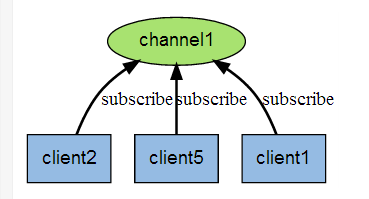
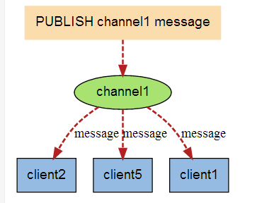
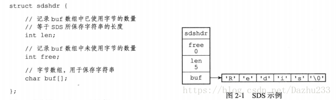
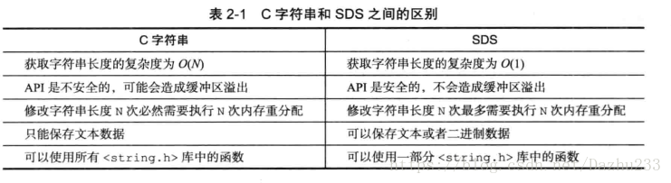
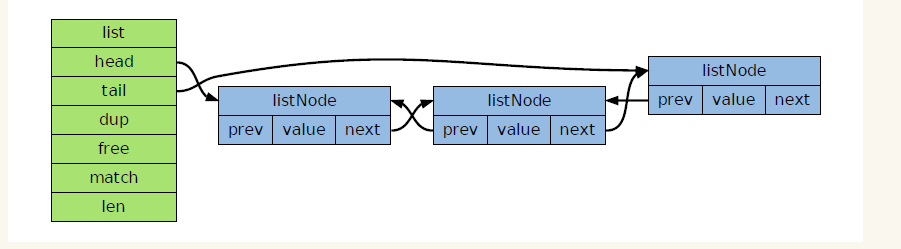

## 1、什么是redis？
答：
Redis全称为REmote DIctionary Server(远程字典服务器)  
是完全开源免费的，用C语言编写的，遵守BSD协议，是一个高性能的(key/value)分布式内存数据库，基于内存运行并支持持久化的NoSQL数据库，是当前最热门的NoSql数据库之一,也被人们称为数据结构服务器。

## 2、redis的特点是什么？
答：
1).Redis支持数据的持久化，可以将内存中的数据保持在磁盘中，重启的时候可以再次加载进行使用    
2). Redis不仅仅支持简单的key-value类型的数据，同时还提供list，set，zset，hash等数据结构的存储    
3).Redis支持数据的备份，即master-slave模式的数据备份    
4).支持事务

## 3、redis的优势是什么？
答：
1）性能极高 – Redis能读的速度是110000次/s,写的速度是81000次/s 。    
2）丰富的数据类型 – Redis支持二进制案例的 Strings, Lists, Hashes, Sets 及 Ordered Sets 数据类型操作。    
3）原子 – Redis的所有操作都是原子性的，同时Redis还支持对几个操作合并后的原子性执行.（事务）    
4) 丰富的特性：可用于缓存，消息，按key设置过期时间，过期后将会自动删除    
5）Redis支持 publish/subscribe, 通知等

## 4、redis的应用场景有哪些？
答：
1）内存存储和持久化：支持异步将内存中的数据写到硬盘上 ，同时不影响继续服务   
2）取最新N个数据的操作如：可以将最新的10条评论的ID放在Redis的List集合里面  
3）模拟类似于HttpSession这种需要设定过期时间的功能  
4）缓存：缓存现在几乎是所有中大型网站都在用的必杀技，合理的利用缓存不仅能够提升网站访问速度，还能大大降低数据库的压力。Redis提供了键过期功能，也提供了灵活的键淘汰策略；  
5）排行榜：很多网站都有排行榜应用的，如京东的月度销量榜单、商品按时间的上新排行榜等。Redis提供的有序集合数据类构能实现各种复杂的排行榜应用。  
6）计数器：什么是计数器，如电商网站商品的浏览量、视频网站视频的播放数等。为了保证数据实时效，每次浏览都得给+1，并发量高时如果每次都请求数据库操作无疑是种挑战和压力。Redis提供的incr命令来实现计数器功能，内存操作，性能非常好;  
7）分布式会话：集群模式下，在应用不多的情况下一般使用容器自带的session复制功能就能满足，当应用增多相对复杂的系统中，一般都会搭建以Redis等内存数据库为中心的session服务，session不再由容器管理，而是由session服务及内存数据库管理。  
8）分布式锁：在很多互联网公司中都使用了分布式技术，分布式技术带来的技术挑战是对同一个资源的并发访问，如全局ID、减库存、秒杀等场景，并发量不大的场景可以使用数据库的悲观锁、乐观锁来实现，但在并发量高的场合中，利用数据库锁来控制资源的并发访问是不太理想的，大大影响了数据库的性能。可以利用Redis的setnx功能来编写分布式的锁，如果设置返回1说明获取锁成功，否则获取锁失败。  
9）社交网络：点赞、踩、关注/被关注、共同好友等是社交网站的基本功能，社交网站的访问量通常来说比较大，而且传统的关系数据库类型不适合存储这种类型的数据，Redis提供的哈希、集合等数据结构能很方便的的实现这些功能。  
10）最新列表：Redis列表结构，LPUSH可以在列表头部插入一个内容ID作为关键字，LTRIM可用来限制列表的数量，这样列表永远为N个ID，无需查询最新的列表，直接根据ID去到对应的内容页即可。  
11）消息系统：消息队列是大型网站必用中间件，如ActiveMQ、RabbitMQ、Kafka等流行的消息队列中间件，主要用于业务解耦、流量削峰及异步处理实时性低的业务。Redis提供了发布/订阅及阻塞队列功能，能实现一个简单的消息队列系统。  

## 5、redis的数据类型。
答：
- String  
string是redis最基本的类型，你可以理解成与Memcached一模一样的类型，一个key对应一个value。
string类型是二进制安全的。意思是redis的string可以包含任何数据。比如jpg图片或者序列化的对象 。
string类型是Redis最基本的数据类型，一个redis中字符串value最多可以是512M
- Hash  
Redis hash 是一个键值对集合。
- List  
Redis 列表是简单的字符串列表，按照插入顺序排序。你可以添加一个元素导列表的头部（左边）或者尾部（右边）。
它的底层实际是个链表
- Set  
Redis的Set是string类型的无序集合。它是通过HashTable实现的，保证唯一性
- Zset  
zset(sorted set：有序集合)
Redis zset 和 set 一样也是string类型元素的集合,且不允许重复的成员。
不同的是每个元素都会关联一个double类型的分数【注意是double类型分数】。
redis正是通过分数来为集合中的成员进行从小到大的排序。zset的成员是唯一的,但分数(score)却可以重复。
- bitmaps  
- hyperloglogs  
- Pub/Sub  
- geospatial  

## 6、redis的bitmaps是什么及应用场景。
答：
Bitmaps不是实际意义上的数据类型，而是定义在字符串类型上的一组面向比特位的操作。  
可以把Bitmaps想象成一个以位为单位数组，数组中的每个单元只能存0或者1，数组的下标在bitmaps中叫做偏移量。单个bitmaps的最大长度是512MB，即2^32个比特位。

应用场景：
统计活跃用户数  
将每个用户的id对应bitmaps上的一个下标，通过对活跃用户对应的位进行置位，就能用一个value记录所有的活跃用户信息。  

需要统计N天内访问网站的用户，连续N天访问网站的用户。  
解决方案：  
我们将每天访问网站的用户存储在一个bitmaps中，通过日期生成键，例如：unique:users:2017-07-11,这样我们就可以统计每天的用户访问。

## 7、redis的hyperloglogs 是什么及应用场景。
答：
Redis HyperLogLog 是用来做基数统计的算法，HyperLogLog 的优点是，在输入元素的数量或者体积非常非常大时，计算基数所需的空间总是固定 的、并且是很小的。  
比如数据集 {1, 3, 5, 7, 5, 7, 8}， 那么这个数据集的基数集为 {1, 3, 5 ,7, 8}, 基数(不重复元素)为5。 基数估计就是在误差可接受的范围内，快速计算基数。

## 8、介绍redis的Pub/Sub。
答：
Redis 发布订阅(pub/sub)是一种消息通信模式：发送者(pub)发送消息，订阅者(sub)接收消息。  

Redis 客户端可以订阅任意数量的频道。  

下图展示了频道 channel1 ， 以及订阅这个频道的三个客户端 —— client2 、 client5 和 client1 之间的关系：  

当有新消息通过 PUBLISH 命令发送给频道 channel1 时， 这个消息就会被发送给订阅它的三个客户端：

## 9、介绍redis的geospatial。
答：
Redis GEO 主要用于存储地理位置信息，并对存储的信息进行操作，该功能在 Redis 3.2 版本新增。  
Redis GEO 操作方法有：  
geoadd：添加地理位置的坐标。  
geopos：获取地理位置的坐标。  
geodist：计算两个位置之间的距离。  
georadius：根据用户给定的经纬度坐标来获取指定范围内的地理位置集合。  
georadiusbymember：根据储存在位置集合里面的某个地点获取指定范围内的地理位置集合。  
geohash：返回一个或多个位置对象的 geohash 值。  

## 10、redis modules是什么？
答：
Redis Modules System是4.0出现一大改动点，使得可以通过外部模块对Redis进行功能性扩展。 Redis的模块采用的是动态链接库的方式，可以启动的时候加载，也可以在运行时加载（MODULE LOAD）。
有很多实用的开源redis modules模块可供使用，例如neural-redis（神经网络数据结构）、RediSearch（redis全文搜索）、RedisBloom（布隆过滤器）等等。。。

## 11、缓存穿透的概念及解决办法？
答：
描述：  
缓存穿透是指缓存和数据库中都没有的数据，而用户不断发起请求，如发起为id为“-1”的数据或id为特别大不存在的数据。这时的用户很可能是攻击者，攻击会导致数据库压力过大。  
解决方案：  
接口层增加校验，如用户鉴权校验，id做基础校验，id<=0的直接拦截；  
从缓存取不到的数据，在数据库中也没有取到，这时也可以将key-value对写为key-null，缓存有效时间可以设置短点，如30秒（设置太长会导致正常情况也没法使用）。这样可以防止攻击用户反复用同一个id暴力攻击

## 11、缓存击穿的概念及解决办法？
答：
描述：  
缓存击穿是指缓存中没有但数据库中有的数据（一般是缓存时间到期），这时由于并发用户特别多，同时读缓存没读到数据，又同时去数据库去取数据，引起数据库压力瞬间增大，造成过大压力。  
解决方案：  
设置热点数据永远不过期。  
加互斥锁。  

## 12、缓存雪崩的概念及解决办法？
答：
描述：  
缓存雪崩是指缓存中数据大批量到过期时间，而查询数据量巨大，引起数据库压力过大甚至down机。和缓存击穿不同的是，缓存击穿指并发查同一条数据，缓存雪崩是不同数据都过期了，很多数据都查不到从而查数据库。  
解决方案：  
缓存数据的过期时间设置随机，防止同一时间大量数据过期现象发生。  
如果缓存数据库是分布式部署，将热点数据均匀分布在不同搞得缓存数据库中。  
设置热点数据永远不过期。  

## 13、假如Redis里面有1亿个key，其中有10w个key是以某个固定的已知的前缀开头的，如何将它们全部找出来？
答：
KEYS命令，加入查找abc开头的key：
KEYS abc*

## 14、如果redis正在给线上的业务提供服务，那使用keys指令会有什么问题？
答：
Redis是单线程的。keys指令会导致线程阻塞一段时间，线上服务会停顿，直到指令执行完毕，服务才能恢复。  
这个时候可以使用scan指令，scan指令可以无阻塞的提取出指定模式的key列表，但是会有一定的重复概率，在客户端做一次去重就可以了，但是整体所花费的时间会比直接用keys指令长。

不过，增量式迭代命令也不是没有缺点的： 举个例子， 使用 SMEMBERS 命令可以返回集合键当前包含的所有元素， 但是对于 SCAN 这类增量式迭代命令来说， 因为在对键进行增量式迭代的过程中， 键可能会被修改， 所以增量式迭代命令只能对被返回的元素提供有限的保证 。

## 14、Redis做异步队列，要怎么做？
答：
一般使用list结构作为队列，rpush生产消息，lpop消费消息。当lpop没有消息的时候，要适当sleep一会再重试。  
不sleep的话可以用bloop指令：  
list还有个指令叫blpop，在没有消息的时候，它会阻塞住直到消息到来。

## 15、能不能生产一次消费多次呢？
答：
使用pub/sub主题订阅者模式，可以实现 1:N 的消息队列。

## 16、pub/sub有什么缺点？
答：
在消费者下线的情况下，生产的消息会丢失，得使用专业的消息队列如RocketMQ等。

## 17、redis的string类型的底层实现。
答：
Redis底层是用C语言写的，Redis中为了实现方便的扩展、安全和性能，自己定义了一个结构用来存储字符串。我们叫它SDS（simple dynamic string）。

## 18、redis的list类型的底层实现。
答：
redis列表使用两种数据结构作为底层实现：双向链表和压缩列表。因为双向链表占用的内存比压缩列表的要多，所以在创建新的列表键时，列表会优先考虑使用压缩列表作为底层实现，并且在有需要的时候，才会从压缩列表实现转换到双向链表实现。  
redis中的双向链表： 
 

　　- 双向链表主要有两个作用：  

　　　　-作为redis列表类型的底层实现之一；  

　　　　-作为通用数据结构，被其他功能模块所使用；  

　　- 双向链表及其节点的性能特性如下：  

　　　　-节点带有前驱和后继指针，访问前驱节点和后继节点的时间复杂度为θ（1），并且堆链表的迭代可以在从表头到表尾和从表尾到表头两个方向进行；  

　　　　-链表带有只想表头和表尾的指针，因此对表头和表尾进行处理的复杂度为θ（1）；  

　　　　-链表带有记录节点数量的属性，所以可以在θ（1）复杂度内返回链表的节点数量（长度）；  

redis中的压缩列表：  
压缩列表是列表键和哈希键的底层实现之一。当一个列表键只包含少量列表项，并且每个列表项要么就是小整数，要么就是长度比较短的字符串，redis就会使用压缩列表来做列表键的底层实现  
当一个哈希键只包含少量键值对，并且每个键值对的键和值要么就是小整数值，要么就是长度比较短的字符串，那么Redis就会使用压缩列表来做哈希键的底层实现。  
压缩列表是Redis为了节约内存而开发的是由一系列特殊编码的连续内存块组成的顺序型数据结构，一个压缩列表可以包含任意多个节点，每个节点可以保存一个字节数组或者一个整数值  

  

